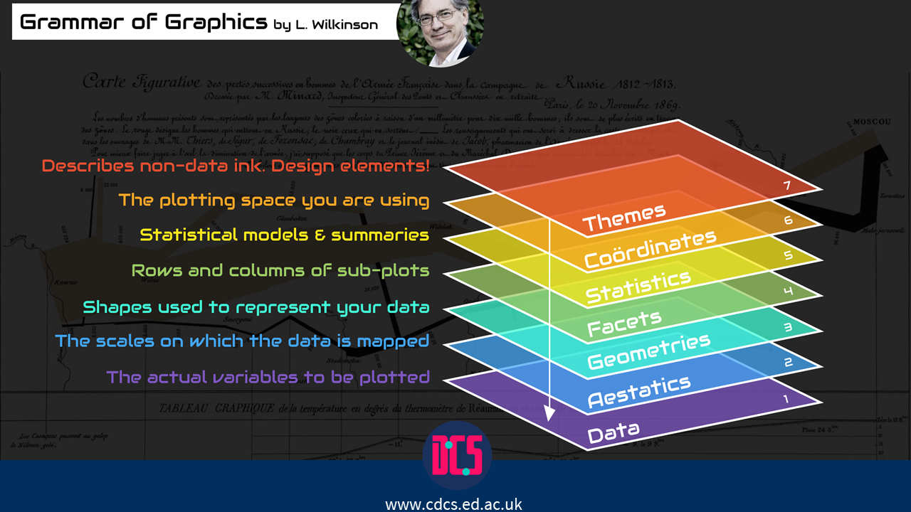
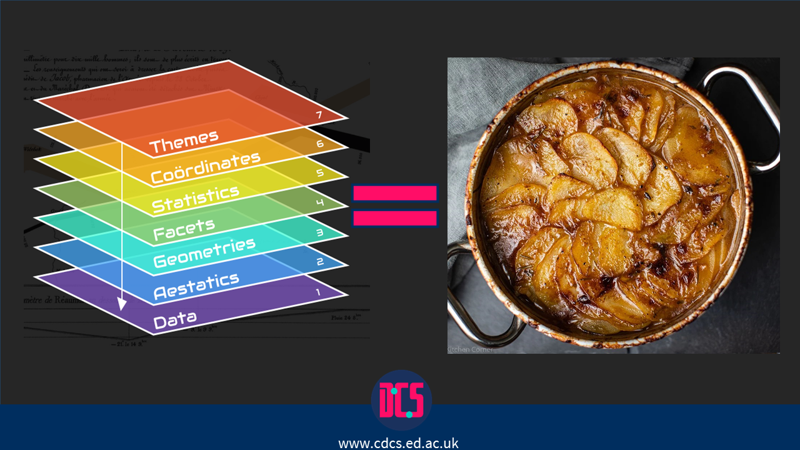

```{r setup, include=FALSE}
knitr::opts_chunk$set(echo = TRUE)
library(tidyverse)
```

# Good Data Visualisation with R - Session 1

This course will focus on developing practical skills for visualising data in R, primarily using the ggplot2 package. A basic understanding of R is assumed, at the level covered in the Introduction to R and RStudio course, though participation in the previous course itself is not required in order to attend this workshop.  

The first session offers an introduction to the ggplot2 package and a practical demonstration of the package. It focuses on topics such as: 

* Ggplot2 syntax 
* Basic plots with ggplot2 
* Deeper customisation of plots, including labels, colour maps, and re-sizing/re-positioning legends 
* Exporting plots 
* Bonus - Some basic table creation

## Some Theory

The main function workhorse for our datavis today will be `ggplot`. This can be accessed through the `tidyverse` package, and so it comes with a whole collection of very useful data wrangling tools. We will be demonstrating throughout this course how we can use data-wrangling alongside datavis to help give us researchers control over how we present our lovely data. Anyhow, I'm getting distracted with the backstory. I need to get to some data vis theory that underpins how we will be designing plots today. This involves covering the **grammar of graphics** (Wilkinson, 2012)[https://link.springer.com/chapter/10.1007/978-3-642-21551-3_13].  

So what is the grammar of graphics? And why is it relevant for creating data visualisation? 




*****

## Why is the Grammar of Graphics relevant for data visualisation?
I'm going to start with the **why** - I find it easier to be engage with theory if I know why I'm doing so. As someone who struggles to understand grammar in the use of language (native bilingual problems...), why do I find it useful in data science/data visualisation? 

Well, simply put: it provides structure and guidance to my code. It helps me create my data visualisation with increased consistency and confidence. And just like with language - grammar rules can be bent to fit our needs. Knowing the rules makes it easier and more playful for us. That way we can be the jazz musicians of data science.

## What is the grammar of graphics?

So I've started backwards with the why to the **grammar of graphics**. Time to move towards the **what**. To use a metaphor, it is a recipe template for data visualisation. It provides us with an outline of the core ingredients/layers, and guidance on where and when to add them. What we get is a lovely casserole of a data visualisation. 



Today we will work through each of the layers, one by one. The aim of this is to highlight how the grammar of graphics is used. (We may also show how sometimes we can bend the rules).

### Layer 1 - The data

Today we will be using another workhorse of the datascience world - the **Iris** dataset. Iris a nice tidy data set, so there will be minimal datawrangling. This way we can focus on the data vis. 

So lets have a look at our Iris data. 
```{r data}
head(iris)
summary(iris)

```

Now that we have a feel for the data, lets start building our plot with ggplot, with our very first layer - **the data layer**.

```{r data layer}

ggplot(iris,)

```

OOOOOOOOO! Look how pretty it is... Ok, it's empty. So what's happened here?

We have told R where want it to look to start the data vis. This is the foundation - the very base layer. In essence, it is the collection of all the ingredients to our lovely data vis casserole. 

Now we need to add the second layer of aesthetics into the ggplot mix.

### Layer 2 - Aestectics

Our first layer was about establishing the data - the core mix of the ingredients. Now we want to set our second layer - the aesthetics. This is our opportunity to tell ggplot what it is in our data we want to plot. 

In this session, we are going to plot `Sepal.Width` against `Petal.Length` from `iris`. However, we will notice that the plot produced still looks rather empty. But we do now have our coordinates set. To draw the connections between our x-axis and y-axis, we need to move to our **geometry** layer. 

```{r aestectic layer}

ggplot(iris,
       aes(x = Sepal.Width, y = Petal.Length))

```

### Layer 3 - The Geometry Layer

Time to connect the dots between `x` and `y` - quite literally this time as we are using `geom_point()`. Notice how we _add_ the additional _layer_ with the `+` sign. 

In fact, a beautiful feature of ggplot is that we can add as many layers as we like. For a full list of layers, please check out here: https://ggplot2.tidyverse.org/reference/ . 

This plot is now looking to be more informative in helping us understand the association between the `Sepal.Width` and `Petal.Lenght` in `iris` flowers. But we can still add additional information to help clarify this data visualisation, and we will do this through the `faceting` layer.

```{r geometry layer}

ggplot(iris,
       aes(x = Sepal.Width, y = Petal.Length)) + 
  geom_point()

```

### Layer 4 - The Facet layer

Here we get a little bit extra creative freedom over our decision making - some of which will be difficult to see until we add our `statistics` layer. And in case you were wondering, to `facet` is to highlight the subgroups within your dataset. In this case, it will be the `species` of the `iris` flowers. However, in more complicated analyses, you might find multiple faceting groups - especially within hierarchical data groups.

It is also worth being aware that sometimes this step can be applied after your statistic layer - but ideally the decision making needs to be informed by the theory underpinning your analysis (you will see why shortly...). 

Anyhow - onto the various ways in which we can `facet` our data. 

#### Option a) facet wrap

```{r facetwrap}
ggplot(iris,
       aes(x = Sepal.Width, y = Petal.Length )) + 
  geom_point() +
  facet_wrap(~Species)

```

#### Option b) - using color 

The 2 options below acheive the same at this stage, but will have subtle differences when it comes to adding the statistic later. We can also define as `shape` or `size` instead of color if we want to (or all at once!).  

```{r colorfacet}
ggplot(iris,
       aes(x = Sepal.Width, y = Petal.Length, color = Species )) + 
  geom_point()
```

```{r colorfacet2}
ggplot(iris,
       aes(x = Sepal.Width, y = Petal.Length)) + 
  geom_point(aes(color = Species))
```

#### Option c) - combining facet and color 

```{r combinedfacet}
ggplot(iris,
       aes(x = Sepal.Width, y = Petal.Length, color = Species )) + 
  geom_point() +
  facet_wrap(~Species)
```

Now that we have faceted our plots, what do we think the association is between `Sepal.Width` and `Petal.Length` in `iris` flowers? 

If you want a *"hint"*, we'll need to a statistic layer to the plot.

### Layer 5 - The Statistic Layer

Here we will learn how we can add a statistic to model the data. Whilst this can help provide us with us additional insights into our data, we do need to exercise some caution when interpreting the data (We'll see why via the Simpson paradox...). 

####  Default model
```{r loess}
ggplot(iris,
       aes(x = Sepal.Width, y = Petal.Length, color = Species )) + 
  geom_point() +
  geom_smooth() # default is loess - local regression (flexible)
```

#### Linear model - and spotting the simpson paradox 

Here will be setting a `linear model` for our statistic, and demonstrating the **2** ways in which the linear model can be applied to our data. 

The first method provides us with an **independent** linear model applied to each subgroup (i.e., `species`). Whilst the second method applies the linear model across the entire dataset. We can define where the statistic is applied by selecting where we set the `color` facet. 

What differences do you notice between the two plots?

Which plot do we think best represents the data?

Which plot do we think best represents the research? ;) 

(For more information - https://en.wikipedia.org/wiki/Simpson%27s_paradox)

```{r simpson_paradox}
plot_a <- ggplot(iris,
       aes(x = Sepal.Width, y = Petal.Length, color = Species )) + 
  geom_point() +
  geom_smooth(method = "lm")  # Model set to "lm" (linear model).
  
plot_a

plot_b <- ggplot(iris,
       aes(x = Sepal.Width, y = Petal.Length)) + 
  geom_point(aes(color = Species)) +
  geom_smooth(method = "lm") 

plot_b
```

##### Find the correct model 

Below are 3 different statistical models. Your task is to determine which of these models represents `plot_a`, and which of these models represents `plot_b`, and how might we plot the other model? 

```{r models}

model_1 <- lm(Petal.Length ~ Sepal.Width, iris)
model_2 <- lm(Petal.Length ~ Sepal.Width + Species, iris)
model_3 <- lm(Petal.Length ~ Sepal.Width * Species, iris)
summary(model_1)
summary(model_2)
summary(model_3)

```

#### Bonus - Plotting complicated models

Our first step here is to set the parameters for our customisable statistic model... which is actually a lot easier than it sounds/reads. 

```{r complex}
#Step 1 - setting the model 
model_complex <- lm(Petal.Length ~ Sepal.Width + Species, iris)

#Step 2 - predicting values with the model
iris_new <- iris %>% mutate(predlm = predict(model_complex))


#Step 3 - Visualising with the predicted values
ggplot(iris_new,
       aes(x = Sepal.Width, y = Petal.Length, color = Species)) + 
  geom_point() +
  geom_line(aes(y = predlm), linewidth = 1)
```

Which of the above statistical models does this plot represent? 

### Layer 6 - The coordinates layer

Here we need to be careful, as sometimes we might inadvertently exxagerate differences by changing the co-ordinates. But at other times it may be necessary.

We also have a variety of methods to play around with the coordinates. These can be used to zoom in on our data, to swap axes, and to fix the ratio's between axes. 

#### coord_cartesian() 

`coord_cartesian()` allows us to zoom in on our data visualisation. This can be very useful to highlight subtle differences within our data, but does run the risk of exaggerating differences within our data... It is a fine line between the two! 

Please note that `coord_cartesian()` does not delete data - our trends will remain the same, even if our perception of the trend changes. 

```{r coord_cartesian}

ggplot(iris,
       aes(x = Sepal.Width, y = Petal.Length, color = Species )) + 
  geom_point() +
  geom_smooth(method = "lm") +
  coord_cartesian(xlim = c(2, # minimum x
                           4.5), # maximum x
                  ylim = c(0.8, #minimum y
                           2)) #maximum y

```

#### coord_flip()

I love `coord_flip()`. However, it's main purpose is somewhat wasted here. It's main benefit is if you want to plot categorical against numerical data. We will demonstrate all of these scenarios below.

##### Coordflip on continuous data

```{r coord_flip_cont}

ggplot(iris,
       aes(x = Sepal.Width, y = Petal.Length, color = Species )) + 
  geom_point() +
  geom_smooth(method = "lm") +
  coord_flip()

```

##### Coordflip on categorical data (just for example)

```{r coord_flip_cat}

# Here we are manipulating the data - we will cover this next week. What we are doing is ensuring we can plot the mean value of Petal.Length of each species. 

iris %>% 
  group_by(Species) %>% 
  summarise(Mean_Petal_Length = mean(Petal.Length)) %>% 
ggplot(aes(x= Species, y = Mean_Petal_Length, fill = Species))+ 
  geom_col() 

iris %>% group_by(Species) %>% 
  summarise(Mean_Petal_Length = mean(Petal.Length)) %>% 
ggplot(aes(x = Species, y = Mean_Petal_Length, fill = Species)) + 
  geom_col() +
  coord_flip()

```

#### coord_fixed()

`coord_fixed()` creates a coordinate system with a specified aspect ratio. This is very useful if both axes use the same units. 

We have included the "unfixed" version of the plot from earlier, so that you can spot the difference. 

```{r fixed_coord}

ggplot(iris,
       aes(x = Sepal.Width, y = Petal.Length, color = Species )) + 
  geom_point() +
  geom_smooth(method = "lm") +
  coord_fixed(ratio = 1)

plot_a

plot_a + 
  coord_fixed(ratio = 3)

```

### Layer 7 - The Theme layer

This is the final step - the theme. This is essentially the decorative stage of the plot, and is a vital component of ensuring our plot can be interpreted clearly and accurately.

Playing with the theme layer involves the labels, the font, the gridlines, the legends... all the extras! And there is a near infinite way of playing with this layer.


#### Using set themes

A full list of the set themes can be found here: https://ggplot2.tidyverse.org/reference/ggtheme.html 

```{r}
plot_a +
  theme_classic()

plot_a +
  theme_dark()

```

#### Customising our themes

We can also combine themes! And you can use the theme commands to customise features of the theme.

```{r}

plot_a +
  theme_classic()+
  theme(legend.position = "bottom")

```

#### Publication ready themes

```{r}

library(jtools) # I use this to create APA ready plots - it also has useful functions for exporting our data analyses.

plot_a +
  theme_apa()

```

#### Adding labels

```{r}

plot_a +
  theme_bw()+
  theme(legend.position = "bottom", legend.direction = "horizontal")+
  labs(title = "Our pretty plot",
       subtitle = "It's really pretty!",
       x = "Sepal Width",
       y = "Petal Length",
       color = "",
       caption = "Made you read me...",
       ) #+
  labs(caption = NULL) # We can use NULL to remove a label

```


### Exporting 

And there we have it! All the layers, to our highly regarded expectations of what our plot should look like. But how do we export it?

Right click on our plot - click save as (or copy). And voila! Plot is exported.


## Bonus Base R detour

This is a short detour - but R does have some built in ready made data vis functions. These aren't pretty, but they are very useful for quick and easy exploration of our variables.

```{r quick and easy data exploration}
boxplot(iris$Sepal.Length) # using $ sign to select a specific variable.
boxplot(iris) #not using $ sign to have boxplots for all variables. Be careful as this might not always work - especially when working with large datasets.

hist(iris$Sepal.Width)

# Using pairs.panels function from psych
#install.packages("psych")
library(psych)
pairs.panels(iris, # data 
             bg=c("blue", "red", "yellow")[factor(iris$Species)], # setting colours for factors
             digits = 3, # setting digits
             method = "pearson", # setting corr method
             pch = 21, # plot character
             stars = TRUE, #corr stars
             lm = TRUE #linear method
             )
```

We can also use base-R to help us quickly check the assumptions underlying our analyses.

```{r model testing}

m <- lm(Petal.Length ~ Sepal.Width * Species, iris) # specifying a model
summary(m) # Checking summary of analysis
plot(m) # plotting the residuals to check model assumptions

```
## Bonus material (if time)
### Automated plots, and fancy tables

This next section is inspired from a blog lesson from: https://rfortherestofus.com/2023/10/ggplots-in-gt-tables 

An often overlooked aspect of data visualisation is table creation. This can be awkward when jumping into R, as we lose the ability to click, drage, and merge in the ways we are used to. But thankfully, there are packages that can be used to facilitate this. In this bonus section, we learn to do the following:

* Create a summary statistics table.
* Make the table pretty.
* Include distribution plots into the table.
* Create a function to automate the the distribution plots (this can be used in other scenario's as well).

Let's get going! We'll work with the `gt` package this time, and stick with the `Iris` dataset. Let's imagine we want to create a summary table of the **Petal Length** across the iris **Species**.

### Basic table

```{r tables}
#install.packages("gt")
library(gt)

# Summary table - basic
Iris_table <- iris %>% 
  group_by(Species) %>%
  summarise(
    min = min(Petal.Length),
    mean = mean(Petal.Length),
    max = max(Petal.Length),
    SD = sd(Petal.Length)
  )

Iris_table

```

### Pretty table

```{r}

Iris_table %>% 
  gt() %>%
  tab_spanner(
    label = 'Iris Petal Length', #title for merged header
    columns = -Species #Not to include species
  ) %>%
  cols_label_with(fn = str_to_title) %>% #changing start of each word to upper case
  fmt_number(decimals = 2) %>% # restricting to 2 decimal places
  cols_align('left', columns = Species) # left aliging Species column to improve readability

```

### Getting funky with plots

So we now have a pretty table that gives us an approximation of the distribution. But how can we improve this? With our good old friend data visualisation. 

These next steps will be focused on creating a distribution plot for each species, which we can then include into the table. This will require some data manipulation for each species... but we're gonna learn a trick to streamline this process for us.

```{r}

Setosa_data <- iris %>% 
  filter(Species == "setosa")

Setosa_data %>% 
  ggplot(aes(x= Petal.Length, y = Species)) +
  geom_violin(fill = "#FF00CC")

Setosa_data %>% 
  ggplot(aes(x= Petal.Length, y = Species)) +
  geom_violin(fill = "#FF00CC") +
  theme_void() # using theme_void() to declutter plot, so that it fits nicely in table.

```

So above is the code for our `setosa` species. Thankfully, there are only 3 species in this data set. But what if we a larger dataset? That would involve a whole load of copy and pasting. It would also make it messy to fit the code into our table. 

To get around this problem, we are going to create function that will automate the process for us.

### Plotting function

```{r plot_function}

# Step 1 - creating a function
plot_violin_species <- function(my_species) { # naming our input for the function
  full_range <- iris %>%
    pull(Petal.Length) %>%
    range(na.rm = TRUE) # creating a range variable 
  
  iris %>% # specifiying the commands of the function
    filter(Species == my_species) %>%
    ggplot(aes(x = Petal.Length, y = Species)) +
    geom_violin(fill = '#FF00CC') +
    theme_minimal() +
    coord_cartesian(xlim = full_range) # adding this so every distribution is set to the same scale 
}

# Step 2 - testing the function

plot_violin_species(my_species = "setosa")
plot_violin_species(my_species = "versicolor")
plot_violin_species(my_species = "virginica")

 
```

### Adding plots to the table

Now that we have our automated plot code, we can work to add it into our pretty summary table. This will include some function creating again. It will also require us to transform our `ggplot` items into `image` formats - as `gt()` doesn't know what to do with `ggplot` items. Thankfully, all that's needed is a line of code!

```{r}
fancy_table <- Iris_table %>%
  mutate(Distribution = Species) %>%
  gt() %>% 
  tab_spanner(
    label = 'Iris Petal Width', #title for merged header
    columns = -Species #Not to include species
  ) %>%
  cols_label_with(fn = str_to_title) %>% #changing start of each word to upper case
  fmt_number(decimals = 2) %>% # restricting to 2 decimal places
  cols_align('left', columns = Species) %>% 
  text_transform(
    locations = cells_body(columns = 'Distribution'),
    fn = function(column) {
      map(column, plot_violin_species) %>% 
        ggplot_image(height = px(40), aspect_ratio = 2.5)
    }
  ) 

fancy_table

```

So there's a few complicated things going on here. But here's our approach to simplify:

* First, text_transform() needs to know the locations of the cells that we want to transform. This information comes from cells_body(columns = 'Distribution') .

* Second, text_transform() needs a function that takes the whole data that is stored in the “Distribution” column and generates images from this. That function is defined in the last segment of the code above (the `function(column) {...` part of the code.

```{r }

function(column) {
  map(column, plot_violin_species) %>%
    ggplot_image(height = px(50), aspect_ratio = 3) # we can play with the numbers here to size our plots
}

```

This function does two things:

1.  map() applies plot_violin_species() for every species. This will give us a list of ggplot-objects . This is not what text_transform() wants. It wants images.

2. the list of ggplot-objects is turned into images with the convenient ggplot_image() function from gt .

The end result is our fancy table with the plots included:

```{r fancy_table}

fancy_table

```

## Playtime 

For the rest of the session, we will do some data-vis playing to consolidate our learning. For this we will use the `PalmerPenguins`![ https://allisonhorst.github.io/palmerpenguins/ ] data set. Below I have provided some skeleton code that you can use for customising. But be brave and try to play around without the stablisiers as well. 

Don't forget to use `summary()` on the dataset to identify the variables you want to plot through the aesthetic line ;) 

```{r playtime}

library(palmerpenguins)  
  summary(penguins)
  
  # standard scatter plot
  ggplot(penguins,
         aes(x = ... , y = ... , color... )) +
    geom_point() 
  
   ggplot(penguins,
         aes(x = ... , y = ... , color... )) +
    geom_point() +
     theme(legend.position = "...") +
     labs(x = "...",
          y = "...",
          title = "...")
  
  # Regression line
   
   ggplot(penguins,
         aes(x = ... , y = ... , color = )) +
    geom_point(alpha = ...)
   
   
  ggplot(penguins,
         aes(x = ... , y = ... , color = )) +
    geom_point(alpha = ...) +
    geom_smooth(method = "lm")
    facet_wrap(~...) +
     theme(legend.position = "...") +
     labs(x = "...",
          y = "...",
          title = "...")
  
    
    # Splitting by category
    ggplot(penguins,
         aes(x = ... , y = ... , color = )) +
    geom_point()
    
  ggplot(penguins,
         aes(x = ... , y = ... , color = )) +
    geom_point() +
    facet_wrap(~...)+
     theme(legend.position = "...") +
     labs(x = "...",
          y = "...",
          title = "...")
  
  
  # Splitting by 2 categories
  ggplot(penguins,
         aes(x = ... , y = ... , color = )) +
    geom_point() +
    facet_grid(~... , ~...) +
     theme(legend.position = "...") +
     labs(x = "...",
          y = "...",
          title = "...")
  
  
  # Automated Penguin Plot (movie script in production...)
  ## Please use this as a template to experiment with! Change the variables, and see what you can make of it
  
  plot_penguin <- function(my_species) {
  penguins %>%
      na.omit() %>%
    filter(species == my_species) %>% # Try replacing the ggplot code from with the ggplot code here! 
    ggplot(aes(x = bill_length_mm, y = bill_depth_mm, 
               color = sex)) +
    geom_point() +
    geom_smooth(method = "lm") +
    theme_minimal() +
      theme(legend.position = "bottom") +
      labs(x = "Bill Length (in mm)",
           y = "Bill Depth (in mm)",
           title = my_species) # When copy and pasting, make sure to keep the title `my_species` 
  }
  
  # Species names: Adelie , Chinstrap , Gentoo - just copy and paste into the function below!
  plot_penguin(my_species = "Gentoo")

```